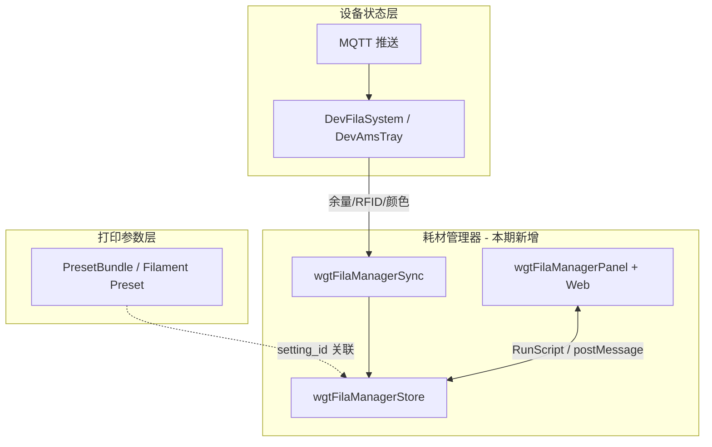
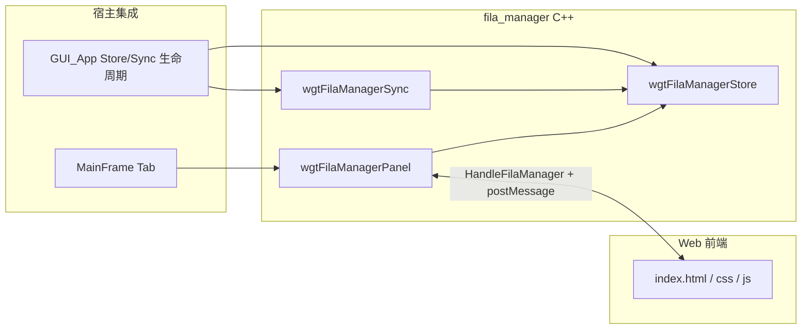
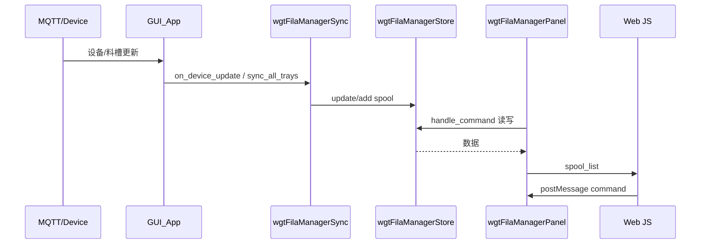

# 耗材管理器（Filament Manager）系统级设计

## 归档信息

| 项 | 说明 |
| --- | --- |
| 来源路径 | `src/slic3r/GUI/fila_manager/filament_manager_spec.md` |
| 归档时间 | `2026-04-16` |
| 适用范围 | 耗材管理器主 spec 全文归档，保留系统级设计、架构图、子系统索引与修订记录 |
| 关联入口 | `功能架构文档/耗材管理器整体架构.md`、`openspec/specs/device/软件代码文档/耗材管理器/README.md` |

本文档描述 Studio **耗材库一期**的整体架构与各子系统职责，作为实现、评审与 AI 辅助开发时的**单一入口**。细则以 OpenSpec 主库与各子目录代码为准。

| 项 | 说明 |
| --- | --- |
| 跟踪 | JIRA: STUDIO-15600 |
| 归档提案/详设 | `openspec/changes/archive/2026-04-07-filament-manager-v1/`（`proposal.md` / `design.md`） |
| 行为规格（OpenSpec） | `openspec/specs/<capability>/spec.md`（见 §9） |

---

## 1. 背景：Studio 内耗材相关层次

耗材管理器解决的是 **「物理库存」** 问题，与既有能力的关系如下。

| 层次 | 代表 | 职责 |
| --- | --- | --- |
| 打印参数层 | `PresetBundle::filaments` | 温度、速度等**切片参数**，多卷可共用同一 Preset（`setting_id`） |
| 设备状态层 | `DevFilaSystem` → `DevAmsTray` | 当前连接设备的料槽：`tag_uid`、`setting_id`、`color`、`remain` 等 |
| **物理库存（本期）** | `FilamentSpool` + Store | 每卷耗材作为资产的录入、编辑、余量、收藏、存档、持久化 |

**关键缺口（本期填补）**：此前无「卷」级生命周期与本地库存台账；Monitor 仅展示设备侧状态，不替代用户侧库存。

---

## 2. 一期目标与范围

### 2.1 Goals

- 独立数据模型 `FilamentSpool`，与 Preset 可选关联，支持手动与 AMS 来源。
- 完整 CRUD：录入（官方/第三方）、编辑、删除、批量删除、收藏、存档、批量添加。
- 当前连接设备 AMS 状态**同步**到耗材库（匹配策略见 §6.5）。
- 以 **MainFrame 顶级 Tab + WebView** 呈现，UI 对齐 Figma（表格主页 + 添加/编辑弹窗）。
- 数据 **本地 JSON** 持久化（`data_dir/filament_inventory/`）。

### 2.2 Non-Goals（一期明确不做）

- 云端同步、Dashboard/BI、「统计」Tab、分组视图完整逻辑。
- 多语言、亮色主题（V1 暗色 + 中文硬编码为主）。
- AMS 读取 Tab 内设备逻辑的完整产品化（可能仅 UI 骨架，以任务/代码为准）。
- 扫码录入、打印流程内余量扣减与替代料推荐。
- 重构 `PresetBundle` / `DevFilaSystem` 内部结构。

---

## 3. 逻辑架构总览

所有 **C++ 新增实现** 统一放在 `src/slic3r/GUI/fila_manager/`，类名前缀 `wgtFilaManager`；**Web 资源** 在 `resources/web/fila_manager/`。

| 子系统 | 职责一句话 |
| --- | --- |
| **宿主与导航** | Tab 枚举、注册、图标、DPI/主题回调 |
| **Panel（UI 壳）** | WebView 生命周期、消息路由 `handle_command`、列表推送 |
| **Store（数据层）** | `FilamentSpool`、CRUD、JSON 原子写入 |
| **Sync（AMS 桥）** | `match_tray`、更新/自动创建 spool、设备更新入口 |
| **Web 前端** | 表格视图、弹窗、筛选排序（客户端）、与 C++ 的 JSON 协议 |

---

## 4. 子系统索引（与 OpenSpec 对应）

| 子系统 | OpenSpec capability | 主规格文件 |
| --- | --- | --- |
| 数据模型与持久化 | `filament-inventory-model` | `openspec/specs/filament-inventory-model/spec.md` |
| WebView Tab 与消息 | `filament-manager-panel` | `openspec/specs/filament-manager-panel/spec.md` |
| 手动录入与批量操作 | `filament-manual-entry` | `openspec/specs/filament-manual-entry/spec.md` |
| AMS 同步 | `filament-ams-sync` | `openspec/specs/filament-ams-sync/spec.md` |
| MainFrame 集成 | `main-frame-navigation` | `openspec/specs/main-frame-navigation/spec.md` |
| 主页表格 UX | `fila-table-view` | `openspec/specs/fila-table-view/spec.md` |
| 添加/编辑弹窗 UX | `fila-add-dialog` | `openspec/specs/fila-add-dialog/spec.md` |

验收与需求细节以 **各 `spec.md` 中 Requirement / Scenario** 为准；本文档不重复逐条抄写。

---

## 5. 各子系统设计摘要

### 5.1 宿主与导航（MainFrame + GUI_App）

**职责**

- 在 `TabPosition`（或等价枚举）中为耗材库分配常量，在 `init_tabpanel` 中创建 `wgtFilaManagerPanel`。
- 提供 Tab 图标（如 `tab_filament_active.svg`），并与现有 Tab 一致的 **DPI 缩放 / 系统颜色** 分发（`msw_rescale`、`on_sys_color_changed` 等）。

**依赖关系**

- 仅依赖 Panel 的公开接口；不直接操作 Store，Store/Sync 由 `GUI_App` 持有并在启动/退出时 load/save，MQTT 路径中调用 Sync（以实现为准）。

**规格**：`main-frame-navigation`。

---

### 5.2 数据层：`wgtFilaManagerStore` + `FilamentSpool`

**职责**

- 内存中维护 `spool_id → FilamentSpool`；提供 add/update/remove、按 id 查询、按 `tag_uid`、按 `setting_id`+`color` 查找（供 AMS 匹配）。
- 持久化路径约定为 `data_dir/filament_inventory/spools.json`（以代码为准）；**临时文件 + rename** 原子写入。
- `to_json` / `from_json`；新字段缺省兼容旧文件。

**模型要点**

- 业务字段：品牌、类型、系列、颜色、重量与余量、`status`（含 archived）、`entry_method`（manual / ams_sync）、绑定设备/AMS 等。
- UX 扩展字段：`favorite`、`unit_price`、`price_currency`、`net_weight`、`dry_date`、`dry_reminder_days`、`remain_alert_pct` 等。

**刻意省略（V1）**：UsageRecord、`consumed_weight`、C++ 端全文搜索、debounce 备份恢复等（见归档 `design.md`）。

**规格**：`filament-inventory-model`。

---

### 5.3 UI 壳层：`wgtFilaManagerPanel`

**职责**

- 创建 wxWebView，加载 `resources/web/fila_manager/` 本地页。
- **C++ → JS**：`RunScript` 调用 `HandleFilaManager({ command, ... })`，典型如 `spool_list` 推送全量列表。
- **JS → C++**：`OnScriptMessage` 解析 JSON，转 `handle_command`。

**命令协议（概念列表）**

- 生命周期：`web_init_completed`、`request_spool_list`
- 单条：`add_spool`、`update_spool`、`remove_spool`、`mark_empty`、`toggle_favorite`、`archive_spool`
- 批量：`batch_remove`、`batch_add`
- 同步：`sync_ams`（由 C++ 调 Sync / 设备逻辑）

**设计决策**：筛选、排序、搜索在 **前端** 对 `g_spools` 做 sort/filter，减轻 C++ 与消息往返。

**规格**：`filament-manager-panel`；交互布局与表格/弹窗见 `fila-table-view`、`fila-add-dialog`。

---

### 5.4 Web 前端子系统（`resources/web/fila_manager/`）

**职责**

- **主页**：左侧导航（我的耗材 / 存档）、工具栏（全部/收藏/AMS、筛选、搜索、批量删除、添加）、`<table>` 列表、空状态。
- **弹窗**：手动添加 / 从 AMS 读取双 Tab、表单、颜色网格、重量三栏、高级设置折叠、数量与编辑模式（隐藏数量）等。

**与规格对应**

- 表格与导航：`fila-table-view`
- 弹窗：`fila-add-dialog`

---

### 5.5 AMS 同步层：`wgtFilaManagerSync`

**职责**

- 订阅设备/料槽更新（入口在 `GUI_App` 侧 MQTT 或设备回调，以实现为准）。
- `match_tray`：**优先** `tag_uid`；否则 **唯一** 时 `setting_id` + `color`；否则 `create_spool_from_tray` 自动录入。
- `sync_all_trays(MachineObject*)` 遍历料槽并写回 Store。

**风险**：多卷同 preset 同色时非 RFID 匹配可能歧义，产品策略为“仅唯一匹配时使用第二优先级”（见归档 `design.md`）。

**规格**：`filament-ams-sync`。

---

## 6. 端到端数据流（概念）

---

## 7. 与外部模块的边界

| 模块 | 关系 |
| --- | --- |
| `PresetBundle` | 仅通过 `setting_id`（等）**关联**打印预设；不修改 Preset 存储格式 |
| `DevFilaSystem` / `DevAmsTray` | Sync **读取**设备状态，写入 Store；不反向改设备协议 |
| `ProjectPanel` | 同为 WebView 模式，通信模式可对齐，代码不强制复用 |

---

## 8. 风险与权衡（摘要）

- WebView 首屏白屏、跨平台差异、表格窄屏横向滚动，与 `ProjectPanel` 同类缓解。
- 色板硬编码、AMS 模式设备逻辑分阶段，见归档 `design.md`「Risks / Trade-offs」全文。
- 数据层放在 `GUI/fila_manager` 而非 `libslic3r`：**不**追求 CLI 复用，换取模块集中。

---

## 9. 文档与规格索引

| 类型 | 路径 |
| --- | --- |
| 本期提案（Why/What/Impact） | `openspec/changes/archive/2026-04-07-filament-manager-v1/proposal.md` |
| 模块级详设（协议、结构体、ASCII 示意） | `openspec/changes/archive/2026-04-07-filament-manager-v1/design.md` |
| UX 对齐（表格/弹窗 delta，已合并主库） | `openspec/changes/archive/2026-04-07-align-fila-manager-ux/` |
| 主库行为规格 | `openspec/specs/*/spec.md`（§4 表） |

运行 `openspec list --specs` 可列出当前主库 capability 与 Requirement 数量；`openspec validate --specs` 用于校验结构。

---

## 10. 修订记录

| 日期 | 说明 |
| --- | --- |
| 2026-04-07 | 初版：整合 proposal/design 与 OpenSpec 子系统划分，作为耗材管理器总览文档 |
